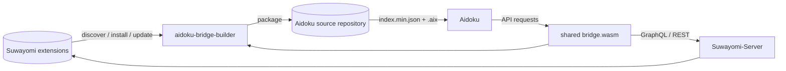
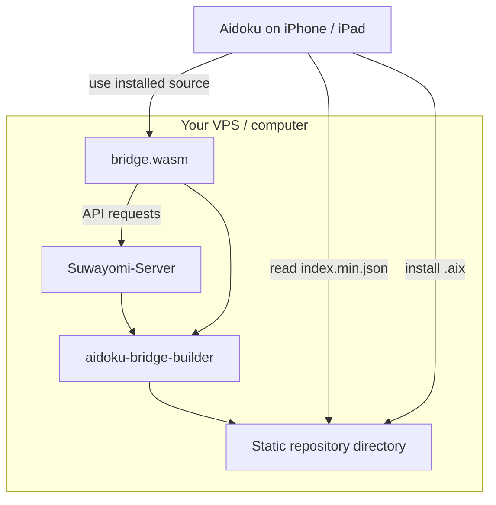

<p align="center">
  <a href="https://github.com/TaisenDev">
    
  </a>
</p>

<h1 align="center">aidoku-bridge-builder</h1>

<p align="center">
  Automated builder and repository generator that exposes a <a href="https://github.com/Suwayomi/Suwayomi-Server">Suwayomi-Server</a> extension catalog to <a href="https://aidoku.app">Aidoku</a> as installable <code>.aix</code> sources.
  <br>
  Heavy lifting in Suwayomi. Lightweight adaptation in the bridge.
</p>

<p align="center">
  <a href="https://github.com/TaisenDev/aidoku-bridge-builder/releases"></a>
  <a href="https://github.com/TaisenDev/aidoku-bridge-builder/commits"></a>
  <a href="https://github.com/TaisenDev/aidoku-bridge-builder/issues"></a>
  <a href="https://github.com/TaisenDev/aidoku-bridge-builder/stargazers"></a>
</p>

> [!IMPORTANT]
> This repository is the **automation and packaging layer**. It does not implement individual manga sources. Source execution is delegated to Suwayomi through the generic [`aidoku-bridge-template`](https://github.com/TaisenDev/aidoku-bridge-template) WASM binary.

## What is this?

`aidoku-bridge-builder` turns the sources already available to a Suwayomi-Server installation into a repository of installable Aidoku `.aix` packages.

The goal is to avoid rewriting or maintaining the same source logic twice.

Suwayomi already knows how to install and execute Mihon/Tachiyomi-compatible extensions. The builder simply takes that source catalog, combines each source's metadata with the shared `bridge.wasm`, and publishes the resulting packages in a format Aidoku can consume.



### In one sentence

> **Suwayomi executes the extension; the bridge translates its API; the builder packages and publishes the result for Aidoku.**

## How it works

Every build/update cycle follows the same pipeline:

| Step | What happens |
| --- | --- |
| **1. Refresh** | Calls Suwayomi's extension API to refresh the available extension catalog. |
| **2. Install** | Automatically installs extensions matching the configured `LANGUAGES` filter when they are not already installed. |
| **3. Update** | Runs `updateExtensions` for installed extensions reporting `hasUpdate`. |
| **4. Read source metadata** | Collects source IDs, names, languages, versions, listings and icons from Suwayomi. |
| **5. Build package metadata** | Writes a source-specific `res/source.json` and `res/settings.json`. |
| **6. Normalize icon** | Converts the source icon into an opaque `128×128` PNG suitable for the Aidoku package. |
| **7. Package** | Creates the `.aix` archive from the shared `bridge.wasm` plus the source-specific `res/` directory. |
| **8. Version** | Computes the Aidoku package version as `extension versionCode × 10 + TEMPLATE_VERSION`. |
| **9. Publish index** | Rewrites `index.min.json` and removes stale packages that are no longer present. |

The result is a static Aidoku source repository that can be served over HTTPS.

## Why use two repositories?

The project intentionally separates **runtime logic** from **automation**.

```text
┌────────────────────────────────────┐
│ aidoku-bridge-template             │
│                                    │
│ Rust → WASM                        │
│ Generic Aidoku ↔ Suwayomi bridge   │
└──────────────────┬─────────────────┘
                   │ bridge.wasm
                   ▼
┌────────────────────────────────────┐
│ aidoku-bridge-builder              │
│                                    │
│ Discover → install → update        │
│ metadata → package → index → serve │
└──────────────────┬─────────────────┘
                   │
                   ▼
             Aidoku .aix repo
```

That separation gives the project two useful properties:

- **The WASM logic is generic.** A source-specific Rust rebuild is not required for each website.
- **The builder is lightweight.** It only needs the prebuilt WASM template plus access to Suwayomi.

The corresponding runtime implementation lives in [`aidoku-bridge-template`](https://github.com/TaisenDev/aidoku-bridge-template).

## Output repository

The generated directory is a normal static web directory:

```text
repo/
├── index.min.json
├── source-a.aix
├── source-b.aix
├── source-c.aix
└── ...
```

Serve this directory over HTTPS and add the `index.min.json` URL to Aidoku.

For example:

```text
https://aidoku.example.com/index.min.json
```

Aidoku can then discover and install the generated sources from that repository.

## Requirements

| Dependency | Purpose |
| --- | --- |
| [Suwayomi-Server](https://github.com/Suwayomi/Suwayomi-Server) | Source of truth for extensions, source metadata, versions and icons |
| [Aidoku](https://aidoku.app) | Client that consumes the generated source list and `.aix` packages |
| Docker | Recommended runtime for the builder |
| `bridge.wasm` | Built once from [`aidoku-bridge-template`](https://github.com/TaisenDev/aidoku-bridge-template) |

Suwayomi documents its GraphQL API at `/api/graphql` and its server is built to run Mihon/Tachiyomi extensions. citeturn206971search1turn431769view1

## Configuration

The builder is configured through environment variables:

| Variable | Required | Default | Description |
| --- | :---: | --- | --- |
| `SUWAYOMI_URL` | No | `http://suwayomi:4567` | Internal URL used by the builder to reach Suwayomi. |
| `PUBLIC_SUWAYOMI_URL` | **Yes** | — | Public URL baked into generated bridge settings. |
| `PUBLIC_REPO_BASE` | **Yes** | — | Base URL used for package/icon downloads. |
| `CADDY_USER` | **Yes** | — | Reverse-proxy username included in generated configuration. |
| `BAKE_CREDENTIALS` | No | `false` | When `true`, also embeds `CADDY_PASS` in generated packages. |
| `CADDY_PASS` | Conditional | — | Reverse-proxy password used only when `BAKE_CREDENTIALS=true`. |
| `LANGUAGES` | No | `all` | Restricts automatic installation, e.g. `es` or `es,en`. |
| `BRIDGE_WASM` | No | `/wasm/bridge.wasm` | Path to the shared template binary. |
| `REPO_DIR` | No | `/repo` | Output directory served as the Aidoku source repository. |
| `POLL_SECONDS` | No | `3600` | Delay between update cycles. |

Missing required variables fail fast with an explicit configuration error.

## Docker

### Pull the image

```bash
docker pull ghcr.io/<OWNER>/aidoku-bridge-builder:latest
```

Replace `<OWNER>` with the GitHub/registry owner used for your published image.

### Build locally

```bash
docker compose up -d --build bridge-builder
```

### Minimal `compose.yaml`

```yaml
services:
  bridge-builder:
    image: ghcr.io/<OWNER>/aidoku-bridge-builder:latest
    volumes:
      - ./repo:/repo
      - ./bridge.wasm:/wasm/bridge.wasm:ro
    environment:
      SUWAYOMI_URL: http://suwayomi:4567
      PUBLIC_SUWAYOMI_URL: https://suwayomi.example.com
      PUBLIC_REPO_BASE: https://aidoku.example.com
      CADDY_USER: proxy-user
      LANGUAGES: all
    restart: unless-stopped
```

The output directory (`./repo` in this example) can be served by Caddy, nginx, an object-storage website, or any other static HTTPS server.

## Versioning strategy

Generated Aidoku packages use:

```text
AIDOKU_VERSION = extension_versionCode × 10 + TEMPLATE_VERSION
```

This makes both sides of the project update-aware:

- a new upstream extension version produces a newer package;
- a new bridge/template version also produces a newer package, even when the upstream extension itself did not change.

That means a template bug fix can propagate through the existing source packages without requiring source-specific Rust changes.

## Credentials & security

Credentials deserve special attention because generated `.aix` packages can be shared independently of the builder.

By default, `BAKE_CREDENTIALS=false`, which avoids embedding the proxy password in every package.

Enabling `BAKE_CREDENTIALS=true` intentionally changes that security model:

> [!WARNING]
> Anyone who obtains a generated `.aix` package may be able to recover the baked password. Treat a credential-bearing package as sensitive and do not publish it to an untrusted location.

Keep secrets out of:

- Git commits
- GitHub Issues / Pull Requests
- Docker images intended for public distribution
- build logs
- public package repositories

## Runtime behavior

The generated bridge does not become a second scraper or source engine.

At runtime the data path remains:

```text
Aidoku
  │
  ▼
bridge.wasm
  │
  ├── GraphQL ───────► Suwayomi-Server
  │                       │
  │                       └── Mihon/Tachiyomi extension
  │
  └── image requests ─► Suwayomi API
```

Chapter pages are returned as remote URLs and streamed through the normal Suwayomi/Aidoku flow. The bridge itself does not maintain a separate local copy of those pages.

## Typical deployment

A practical setup looks like this:



The builder can therefore run alongside Suwayomi on the same machine or reach a remote Suwayomi instance over the configured URL.

## Manual repository setup

Once the builder is running:

1. Expose `REPO_DIR` through HTTPS.
2. Confirm that `index.min.json` is publicly reachable.
3. Add that URL to Aidoku as a source list.
4. Install the generated sources.
5. Configure the proxy/server password in Aidoku when the package does not contain it.

Example source-list URL:

```text
https://aidoku.example.com/index.min.json
```

## Relationship with Suwayomi

Suwayomi is the core execution layer in this architecture. Its server runs Mihon/Tachiyomi-compatible extensions and exposes their functionality through its APIs. citeturn431769view1turn206971search0

This project therefore focuses on **adaptation and packaging**, not on reproducing the source ecosystem.

## Related repository

### [`aidoku-bridge-template`](https://github.com/TaisenDev/aidoku-bridge-template)

Contains the reusable Rust/WASM implementation that maps Aidoku's source interface to Suwayomi's API.

### [`aidoku-bridge-builder`](https://github.com/TaisenDev/aidoku-bridge-builder)

This repository: automates discovery, installation, updating, packaging, indexing, and serving.

## Project links

| Resource | Link |
| --- | --- |
| Organization | [TaisenDev](https://github.com/TaisenDev) |
| Builder | [aidoku-bridge-builder](https://github.com/TaisenDev/aidoku-bridge-builder) |
| Template | [aidoku-bridge-template](https://github.com/TaisenDev/aidoku-bridge-template) |
| Suwayomi-Server | [Suwayomi/Suwayomi-Server](https://github.com/Suwayomi/Suwayomi-Server) |
| Aidoku | [aidoku.app](https://aidoku.app) |
| Aidoku Rust API / CLI | [Aidoku/aidoku-rs](https://github.com/Aidoku/aidoku-rs) |

## Contributing

Issues and pull requests are welcome.

When reporting a problem, include the relevant builder logs and environment configuration **without exposing credentials**.


<p align="center">
  <sub>Built around <a href="https://github.com/Suwayomi/Suwayomi-Server">Suwayomi</a> and <a href="https://aidoku.app">Aidoku</a>.</sub>
</p>
